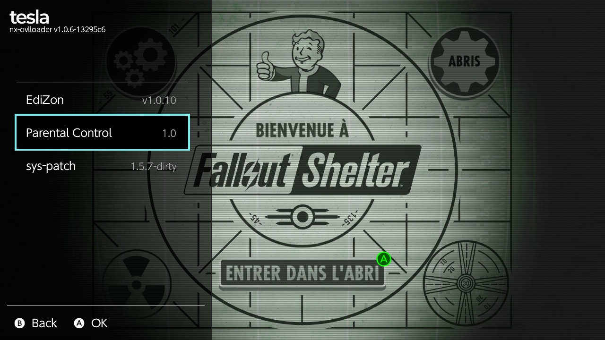
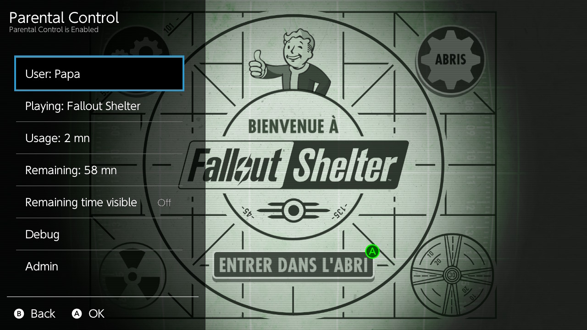
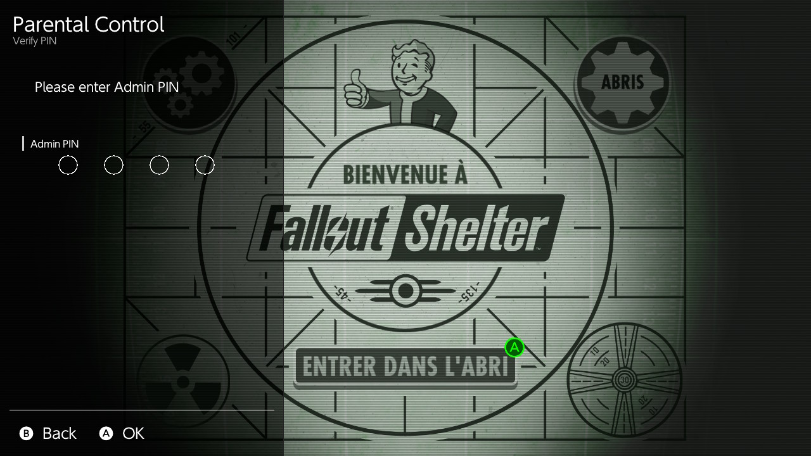
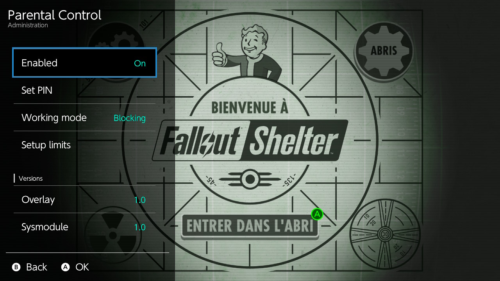
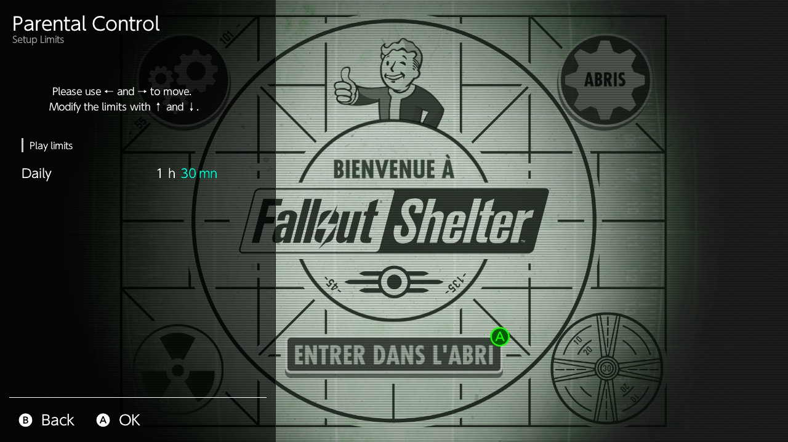

# NS Parental Control

NS Parental Control is a simple parental control system for the Nintendo Switch which does not require Internet access or a smartphone to operate.

It can be used freely.

The user manual can be found [here](docs/manual.md).

## Dependencies

Linked with:
- libnx 4.10.0 
- libultrahand 2.2.0

## Table of Contents

- [Users categories](#users-categories)
- [Current features](#current-features)
- [Coming features](#coming-features)
- [Screenshots](#screenshots)
- [Licence](#licence)
- [Installation](#installation)
- [Build and install](#build-and-install)
- [References](#references)

## Users categories

The following users are involved:
- Gamers: the persons who want to play games.
- Administrator: the person who defines the rules and sets the limits.

## Current features 

Parental control has the following features:

**Gamers**
- Check the played time (since 1.0)
- Check the remaining play time (since 1.0)
- When the time is out, the system is blocked (since 1.0)
- Be notified every 15 minutes and every minute in the last 5 minutes (since 1.2)
- Get usage history (since 1.2)

**Administrator** (protected by a PIN code)
- Define a PIN to protect setup access - *default PIN is A A A A* (since 1.0)
- Enable or disable the parental control (since 1.0)
- Enable or disable the notifications (since 1.2)
- Choose the log level between Debug and Information (since 1.2)

## Coming features

Coming features are in the [GitHub project](https://github.com/users/TristanIsrael/projects/6/views/1) page.

## Screenshots

**Tesla Main Menu**

**Parental control main menu**

**Parental control admin PIN**

**Parental control admin menu**

**Parental control limits settings**

**Timeout screen**

## Licence

The source code and the binaries are under [GPL v3 licence](LICENSE). 

You can:
- use it freely,
- modify it.

You must:
- share your changes by committing on this repository or your own fork.

You are not allowed to:
- close the sources,
- sell the product,
- reuse the source code in a commercial product,
- use your own modified version.

### Dependencies

Libraries linked or code reused:
- AES and SHA256 from **Brad Conte** ([GitHub](https://github.com/B-Con/crypto-algorithms)) - no licence.
- Tesla,
- libNX.

## Installation

1. Install the required [**Tesla Menu**](https://switch.hacks.guide/homebrew/tesla-menu.html) or [**Ultrahand Overlay**](https://github.com/ppkantorski/Ultrahand-Overlay).

⚠️ If you want notifications you have to install **[Ultrahand Overlay](https://github.com/ppkantorski/Ultrahand-Overlay)**. Please look at its documentation to know how to install it and how to enable the notifications.

2. Download the latest release from [GitHub](https://github.com/TristanIsrael/NSParentalControl/releases/tag/1.1).

Here are the files and their destination:

| File | Destination | Description |
|--|--|--|
| exefs.nsp | /atmosphere/contents/4200000000003103 | The core of the system as a *sysmodule* |
| toolbox.json | /atmosphere/contents/4200000000003103 | A description file for Atmosphère |
| boot2.flag | /atmosphere/contents/4200000000003103/flags | Mandatory file to make the sysmodule start at boot |
| parental_control.ovl | /switch/.overlays | The overlay |

After copying the files, reboot the console.

## Build and install

This section explains how to create and install the binary for NS Parental Control.

### Architecture

This product relies on 2 components:
1 - a sysmodule that monitors the games usage and notifies when limit is reached. 
2 - an overlay that shows on demand information about the limits and permits setup of the limits.

The sysmodule and the overlay share a common database file. 

### Pre-requisistes for runtime

- Atmosphere installed
- Tesla menu installed or Ultrahand overlay for notification

### Pre-requisites for build

- Development computer with `devkitPro` and `devkitA64` (see below)
- `libnx` (Switch homebrew SDK) installed via devkitPto
- Atmosphere source code (see below)

### devkitPro and devkitA64 installation

Installation of devkitPro is described on [this page](https://switchbrew.org/wiki/Setting_up_Development_Environment).

### Build the sysmodule

Once the code is downloaded or cloned do the following:

Go to the directory `NSParentalControl/sysmodule`

Run the command `$ make`. At the end of the build, the `out.nosync` directory contains the file `exefs.nsp`.

This file should be copied in the directory `/atmosphere/contents/4200000000003103` of the SD card of the Switch.

### Build the overlay

Go to the directory `NSParentalControl/overlay`.

Run the command `$ make`. At the end of the compilation process, the directory contains a file name `parental_control.ovl`. 

Copy this file in the directory `/switch/.overlays/` in the SD card of the Switch.

### Auto-start Parental Control

In order for the parental control to load on startup you have to create a new folder named `flags` into `/atmosphere/contents/4200000000003103`. 

In this folder create an empty file named `boot2.flag`.

## References

https://github.com/switchbrew/switch-examples/tree/master

## Credits

- Niels Lohmann <https://nlohmann.me> for JSON C++ library.
- @SciresM for Atmosphère.
- Sean Barrett for STB Truetype library.
- @WerWolv for [Tesla library](https://github.com/WerWolv/libtesla).
- @ppkantorski for [Ultrahand Overlay](https://github.com/ppkantorski/Ultrahand-Overlay).
- @tallbl0nde for IPC Server (from TriPlayer)
