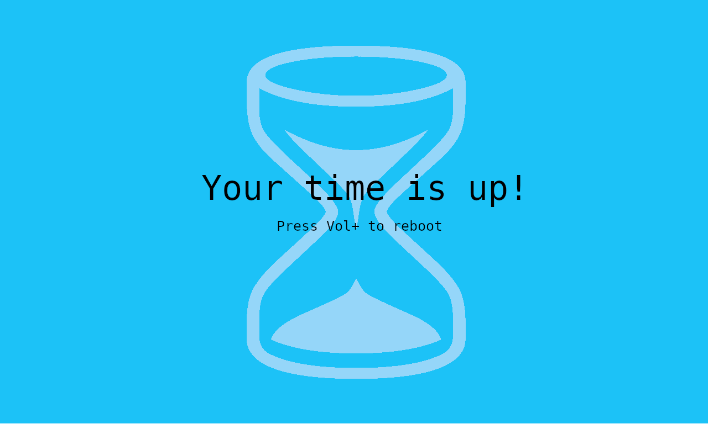

# NS Parental Control

⚠️ **Warning**: This is a proof of concept under development.

NS Parental Control is a simple parental control system for the Nintendo Switch which does not require Internet access or a smartphone to operate.

It can be used freely.

## Current version

1.0.0 (MVP)

## Users categories

The following users are involved:
- Gamers: the persons who want to play games.
- Administrator: the person who defines the rules and sets the limits.

## Current features 

Parental control has the following features:

**Gamers**
- Check the played time
- Check the remaining play time
- When the time is out, the system is blocked

**Administrator** (protected by a PIN code)
- Define a PIN to protect setup access
- Enable or disable the parental control

## Coming features

Coming features are in the [GitHub project](https://github.com/users/TristanIsrael/projects/6/views/1) page.

## Screenshots

## Licence

The source code and the binaries are under [GPL v3 licence](LICENSE). 

You can:
- use it freely,
- modify it.

You must:
- share your changes by committing on this repository or your own fork.

You are not allowed to:
- close the sources,
- sell the product,
- reuse the source code in a commercial product,
- use your own modified version.

### Dependencies

Libraries linked or code reused:
- AES and SHA256 from **Brad Conte** ([GitHub](https://github.com/B-Con/crypto-algorithms)) - no licence.
- Tesla,
- libNX.

## Installation

1. Install the required [**Tesla Menu**](https://switch.hacks.guide/homebrew/tesla-menu.html).

2. Download the latest release from [GitHub](https://github.com/TristanIsrael/NSParentalControl/releases/tag/1.0).

Here are the files and their destination:

| File | Destination |
|--|--|
| exefs.nsp | /atmosphere/contents/420000000003103 |
| toolbox.json | /atmosphere/contents/420000000003103 |
| parental_control.ovl | /switch/.overlays |

After copying the files, reboot the console.

## Build and install

This section explains how to create and install the binary for NS Parental Control.

### Architecture

This product relies on 3 components:
1 - a sysmodule that monitors the games usage and notifies when limit is reached. 
2 - an overlay that shows on demand information about the limits and permits setup of the limits.

The sysmodule and the overlay share a common database file. 

### Pre-requisistes for runtime

- Atmosphere installed
- Tesla menu installed

### Pre-requisites for build

- Development computer with `devkitPro` and `devkitA64` (see below)
- `libnx` (Switch homebrew SDK) installed via devkitPto
- Atmosphere source code (see below)

### devkitPro and devkitA64 installation

Installation of devkitPro is described on [this page](https://switchbrew.org/wiki/Setting_up_Development_Environment).

### Download Atmosphere source code

Atmosphere source code is needed to build the sysmodule.

The code can be downloaded using [this link](https://github.com/Atmosphere-NX/Atmosphere/archive/refs/heads/master.zip) or by cloning the repository using the repo URL https://github.com/Atmosphere-NX/Atmosphere.git.

### Build Atmosphere sysmodule

Once the code is downloaded or cloned do the following:

- copy the folder `pctrl` into `<Atmosphere source dir>/stratosphere/`.
- append `pctrl` to the declaration of `MODULES` in `<Atmosphere source dir>/stratosphere/stratosphere.mk` or run `$ sed -i.bak 's/^\(ALL_MODULES :=.*\)$/\1 pctrl/' stratosphere.mk`
- build stratosphere by running `$ make` in the directory `<Atmosphere source dir>/stratosphere`.

You way need to build Atmosphere in a first step by running the command `$ make` in the root of Atmosphere directory.

At the end of the build, the sysmodule is available in the directory `<Atmosphere source dir>/stratosphere/pctrl/out/nintendo_nx_arm64_armv8a/release/pctrl.nsp`. 

Rename it to `exefs.nsp`.

This file should be copied in the directory `/atmosphere/contents/420000000003103` of the SD card of the Switch.

### Build the ovverlay

Go to the directory `NSParentalControl/overlay`.

Run the command `$ make`. At the end of the compilation process, the directory contains a file name `parental_control.ovl`. 

Copy this file in the directory `/switch/.overlays/` in the SD card of the Switch.

### Auto-start Parental Control

In order for the parental control to load on startup you have to create a new folder named `flags` into `/atmosphere/contents/420000000003103`. 

In this folder create an empty file named `boot2.flag`

## References

https://github.com/switchbrew/switch-examples/tree/master

